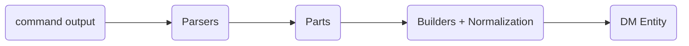

При разработке ACL NAT Сетевых устройств существует проблема  - необходимо парсить и заполнять одинаковые сущности Protocol, Source, Destination ... и т.д
это приводит к одинаковым \ почти одинаковым реализациям  
к примеру nftables 

Для решения этой проблемы я предлагаю использовать такую схему 
(все части независимые и заменяемые )


### Парсеры 

Парсер — обычная функция, которая пытается «откусить» кусочек от начала текста.[link](https://habr.com/ru/articles/1016632/)
в нашем случае 

```rust 
tag(-A) -> `-A OUTPUT -p tcp --port 50\n` -> ('-A',  ' OUTPUT -p tcp --port 50\n')
```

Возьмем  правило nftables 
`-A OUTPUT -p tcp --port 50\n`

Парсим протокол `tcp`

```rust 
fn protocol<'a>(s: &'_ str) -> IResult<&'_ str, d::ProtocolType)> {
	alt(( // применяет парсеры по списку (или)
	    into(alpha1), // если строка 
        into(u8), // если число 
	)).parse(s)
}

pub enum ProtocolType {
    String(Str),
    Number(u8),
    TCP,
    UDP,
}

комбинатор into автоматически вызывает нужный метод from у ProtocolType

impl From<u8> for ProtocolType {
    fn from(value: u8) -> Self {
        if value == 6 {
            return Self::TCP;
        }
        ...

        Self::Number(value)
    }
}

impl From<&str> for ProtocolType {
    fn from(value: &str) -> Self {
	    ...
    }
}

protocol("tcp --port 50\n") -> (" --port 50\n", d::ProtocolType::TCP)
```

Портов много вариантов 
```
--sport 500:600 
! --dport 45
! --ports 50,300:400    
```

```rust
fn port(arg: &'static str) -> impl Fn(&str) -> IResult<&str, Vec<d::PortOperator>> {
    move |input: &str| {
        let port = map(SingleOrPairU16::sep_colon, |v| vec![v]); // 45 и оборачиваем в лист 
        let ports = separated_by_comma(SingleOrPairU16::sep_colon); // 300:400

        p::port_many(pair(operator, preceded_tag_space(arg, alt((ports, port))))).parse(input)
    }
}
```
где 
```rust 
SingleOrPairU16::sep_colon('45') -> Tuple::Single(45)
SingleOrPairU16::sep_colon('300:400') -> Tuple::Pair(300, 400)
```
Где 
```rust 

pair(operator, preceded_tag_space("--ports", alt((ports, port)))).parse("! --ports 50,300:400")


1. 
   operator.parse("! --ports 50,300:400") -> (Operator(!), "--ports 50,300:400")
2. 
   preceded_tag_space("--ports", ...).parse("--ports 50,300:400") -> "50,300:400"
3.
 alt((ports, port)).parse("50,300:400") -> [Tuple::Single(45), Tuple::Pair(300, 400)]
   
   
p::port_many(Operator(!), [Tuple::Single(45), Tuple::Pair(300, 400)]) 

p::port_many применяет d::PortOperator::new к списку 

pub struct PortOperator(Operator<PortType, u16>);

impl PortOperator {
    pub fn new(operator: impl Into<bool>, value: Tuple<u16>) -> Self {
        let (operator, value) = match (operator.into(), value.is_single()) {
            (true, true) => (PortType::EQ, value),
            (true, false) => (PortType::RANGE, value),
            (false, true) => (PortType::NEQ, value),
            (false, false) => (PortType::NotRange, value),
        };
        Self(Operator { operator, value })
    }
}

```
operator.into() вызывает `From<Operator>`
где Operator автоматически конвертируется в bool
```rust
fn operator(s: &str) -> IResult<&str, Operator> {
    let operator_ = value(d::nftables::EXCLAMATION, tag("!"));

    map(parser, Operator::new).parse(s)
}


pub struct Operator(Option<&'static str>);

impl From<Operator> for bool {
    fn from(val: Operator) -> Self {
        val.is_none()
    }
}
```

```rust
Operator(!).into()  => false
Operator( ).into()  => true
```
и 
```rust
Tuple::Single.is_single()  => true
Tuple::Pair.is_single()  => false
```
В результате 
```rust
Operator(!), [Tuple::Single(45), Tuple::Pair(300, 400)] ->
[PortOperator(PortType::NEQ, 45), PortOperator(PortType::NotRange, (300, 400))]
```

на уровне протокола 
```rust 

pub enum PROTOCOL {
	Ports(Vec<d::PortOperator>),
    SourcePorts(Vec<d::PortOperator>),
    DestinationPorts(Vec<d::PortOperator>),
    ...
}

fn protocol_setting(input: &str) -> IResult<&str, PROTOCOL> {
    alt_impl!(
        PROTOCOL,
        "Ports" = port("--ports"),
        "SourcePorts" = alt((port("--sports"), port("--sport"), port("--ctorigsrcport"))),
        "DestinationPorts" = alt((port("--dports"), port("--dport"), port("--ctorigdstport"))),
       ...
    )
    .parse(input)
}
```

на уровне правила 
```rust 
pub enum ACLRule {
	Protocol(ProtocolPart<Operator>),
	...
	Error(&'a str),
	Space,
}

fn acl_parser<'a>(input: &'a str) -> IResult<&'a str, ACLRule<'a>> {
	alt_impl!(
		ACLRule,
		"Protocol" = protocol_setting,
		...
		"space" = space1,
		"Error" = unknown_part,
	)
	.parse(input)
}
```

Таким образом правило 
`-A OUTPUT -s 192.168.0.1/32 -p tcp -m multiport --ports 50:60,300:400\n` 
парсится в ACLRule

Это позволяет собирать мелкие парсеры со встроенной логикой в списки и легко переиспользовать и композировать 
### Билдеры 
Все билдеры реализуют интерфейсы
```rust

pub trait Builder<T> {
    fn build(self) -> T; где T это Часть сущности доменной модели например d::ProtocolSetting или часть Nftables.ChainRule
}

pub trait Mapper<T> {
    fn mapping(&mut self, item: T); где T это Parts например ACLRule<'a>
}
```
### Доменная модель
```rust
pub struct General {
    #[serialize(rename = "LineNumber")]
    line_number: usize,
    #[serialize(rename = "Raw")]
    
}
```

ACL
```rust 
pub struct ACL<T> {
    #[serialize(rename = "ActionModifiers")]
    action_modifiers: Vec<ActionSetting<T>>,
}

вендор специфичная часть
pub struct ACLExtended {
    #[serialize(rename = "ConnectionStates")]
    connection_states: Vec<d::StringOperator>,
    #[serialize(rename = "Sets")]
    sets: Vec<d::SetOperator>,
}
```

NAT
```rust
pub struct NAT<T> {
    #[serialize(rename = "Type")]
    type_: T,
    ...
}

вендор специфичная часть
pub struct NATExtended {
    #[serialize(rename = "ConnectionStates")]
    connection_states: Vec<d::StringOperator>,
    #[serialize(rename = "Sets")]
    sets: Vec<d::SetOperator>,
    #[serialize(rename = "NetworkMappedTranslatedAddress")]
    network_mapped_translated_address: Option<d::IPOperator>,
    #[serialize(rename = "Target")]
    target: Option<d::Str>,
}
```

и дальше композиция билдеров 
```rust
pub struct RawRule<T> {
    // билдеры
    protocol: ProtocolSettingBuilder,
    general: GeneralBuilder,
    extended: T, // ACLBuilder или NATBuilder
    vendor: VendorBuilder,
    // шаред поля
    pub chain: d::Str,
}

impl<'a> Mapper<ACLRule<'a>> for RawACLRule<'a> {
    fn mapping(&mut self, item: ACLRule<'a>) { // ACLRule из парсера 
        match item {
            ACLRule::Error(v) => println!("Error: {:?}", v),
            ACLRule::Space => (),
            ACLRule::Protocol(protocol) => self.protocol.mapping(protocol),
            ACLRule::General(v) => self.general.mapping(v),
            ACLRule::Extended(v) => self.extended.mapping(v),
            ACLRule::Vendor(v) => self.vendor.mapping(v),
        };
    }
}

impl<'a> Builder<d::nftables::ACLRule> for RawACLRule<'a> {
    fn build(mut self) -> d::nftables::ACLRule // Nftables.ChainRule {
        self.general.protocol_setting(self.protocol.build());

        d::Rule::new(
            self.general.build(),
            self.extended.build(),
            self.vendor.build(),
        )
    }
}
```


maturin 0.12.20
pip install maturin==0.12.20
pyo3 0.15.2

```python
from parser_rust import get, Context

c = Context([], [])
get("-A INPUT -g TEST --ctstate RELATED,ESTABLISHED", c)

get("-A INPUT -j DROP -i swp+ -o swp1", Context([], ["swp1", "swp2"]))

```

#### Сборка линуксов 
```
pyenv activate parser
maturin build -r -m parser/Cargo.toml
```

#### сборка windows 64
```bash
pyenv activate parser
export PYO3_CROSS_LIB_DIR='/AppData/Local/Programs/Python/Python36/libs'
maturin build -r -m parser/Cargo.toml --target x86_64-pc-windows-gnu
```
#### сборка windows 32

```bash
pyenv activate parser
export PYO3_CROSS_LIB_DIR='/AppData/Local/Programs/Python/Python36-32/libs'
maturin build  -m parser/Cargo.toml --target i686-pc-windows-gnu
```

```
  PYO3_PRINT_CONFIG=1 is set, printing configuration and halting compile --
  implementation=CPython
  version=3.6
  shared=true
  abi3=true
  lib_name=python3
  lib_dir=/AppData/Local/Programs/Python/Python36-32/libs
  build_flags=WITH_THREAD
  suppress_build_script_link_lines=false
```


### outdated 


extension-module по умолчанию выключен

https://pyo3.rs/v0.23.5/faq.html#i-cant-run-cargo-test-or-i-cant-build-in-a-cargo-workspace-im-having-linker-issues-like-symbol-not-found-or-undefined-reference-to-_pyexc_systemerror

если запустить cargo test без этого модуля 
`note: rust-lld: error: unable to find library -lpython3.12`

#### тесты 
```
cargo test --features "extension-module"
```

#### тесты с python
```
pyenv activate parser
export LD_LIBRARY_PATH=/home/archman/.pyenv/versions/3.6.15/lib/ 
cargo test --config 'build.rustflags=["--cfg", "python_required"]'
```

#### сборка 

```
pyenv activate parser
maturin develop -m parser/Cargo.toml --cargo-extra-args="--features "extension-module""
```

